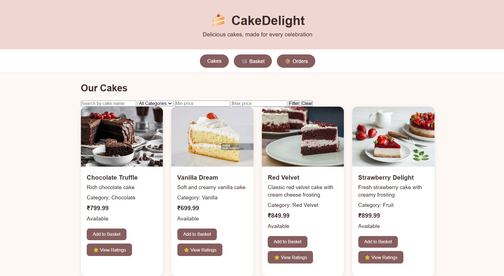
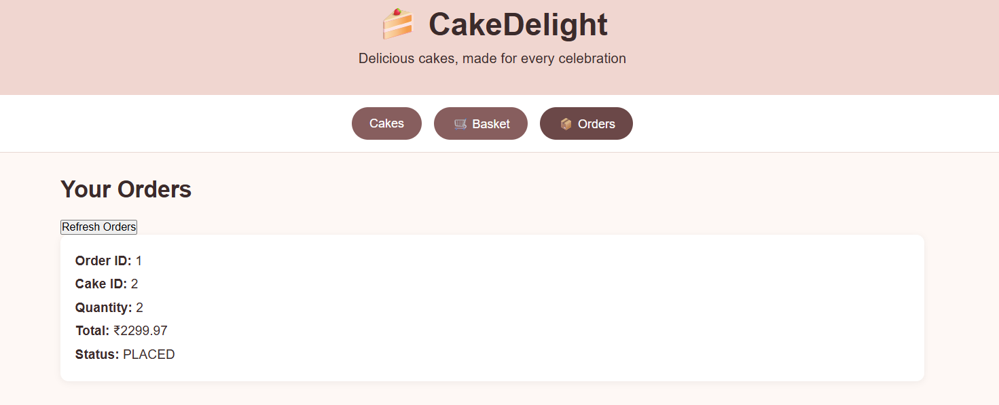
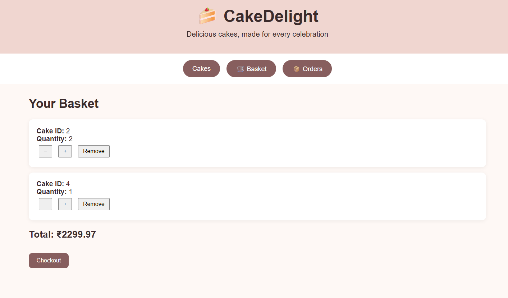
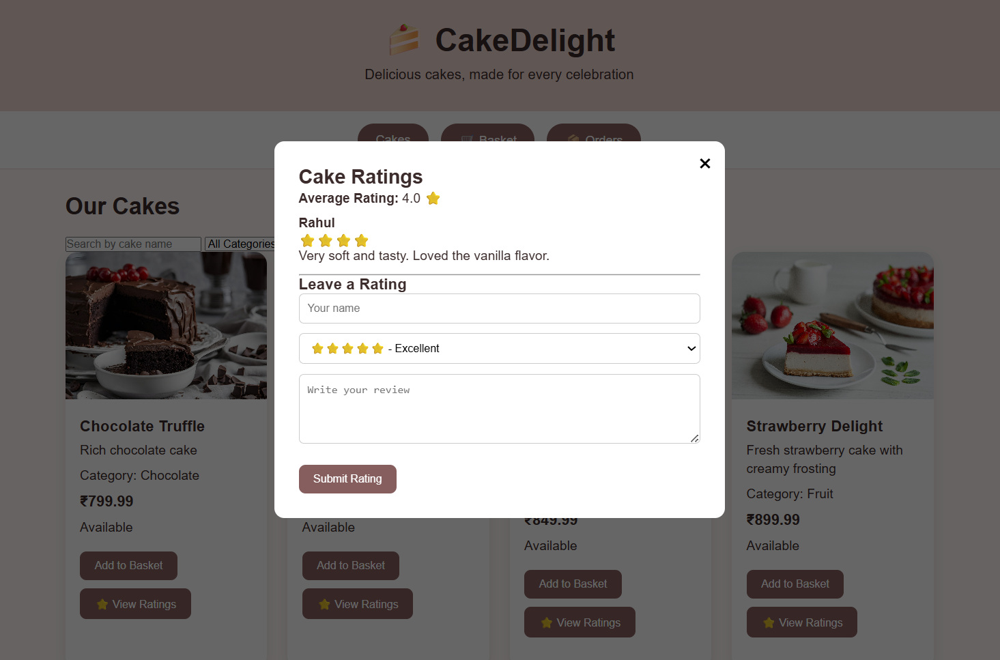
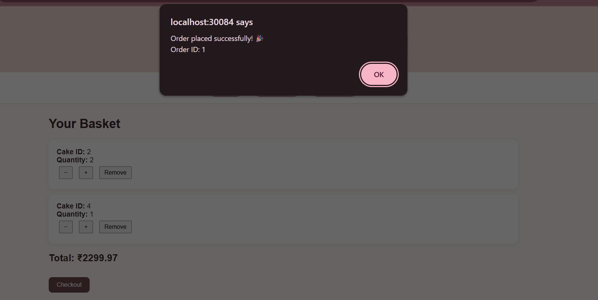
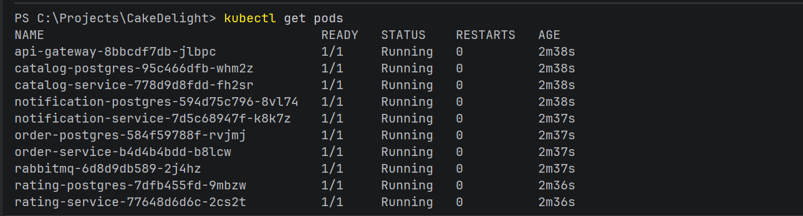
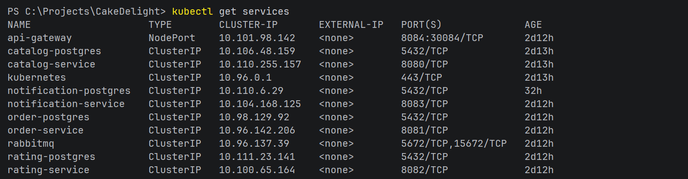

# CakeDelight 🍰

CakeDelight is a cloud-native e-commerce application for browsing cakes, managing a shopping basket, placing orders, viewing ratings, and receiving order notifications.

The application is implemented using a microservices architecture and can be run using either Docker Compose or Kubernetes.

---

## Documentation

- [API Documentation](docs/API-DOCUMENTATION.md)
- [Database Schema](docs/DATABASE-SCHEMA.md)
- [Event Contract](docs/EVENT-CONTRACT.md)

---

## Application Preview



## 1. Architecture

CakeDelight consists of the following microservices:

```text
                           ┌─────────────────────┐
                           │     API Gateway     │
                           │       :8084         │
                           │   UI + REST Gateway │
                           └──────────┬──────────┘
                                      │
                    ┌─────────────────┼─────────────────┐
                    │                 │                 │
                    ▼                 ▼                 ▼
             ┌─────────────┐   ┌─────────────┐   ┌─────────────┐
             │   Catalog   │   │    Order    │   │   Rating    │
             │   :8080     │   │   :8081     │   │   :8082     │
             └──────┬──────┘   └──────┬──────┘   └──────┬──────┘
                    │                 │                 │
                    ▼                 ▼                 ▼
             ┌─────────────┐   ┌─────────────┐   ┌─────────────┐
             │  Catalog    │   │    Order    │   │   Rating    │
             │ PostgreSQL  │   │ PostgreSQL  │   │ PostgreSQL  │
             └─────────────┘   └─────────────┘   └─────────────┘

                                      │
                                      ▼
                               ┌─────────────┐
                               │  RabbitMQ   │
                               │    :5672    │
                               └──────┬──────┘
                                      │
                                      ▼
                             ┌──────────────────┐
                             │   Notification   │
                             │      :8083       │
                             └──────────────────┘
```

---

## 2. Microservices

| Component | Port | Responsibility |
|---|---:|---|
| API Gateway | 8084 | Main entry point, REST routing and web UI |
| Catalog Service | 8080 | Cake catalog CRUD operations |
| Order Service | 8081 | Orders and shopping basket |
| Rating Service | 8082 | Cake ratings and reviews |
| Notification Service | 8083 | Processes order notifications |
| Catalog PostgreSQL | 5432 | Catalog database |
| Order PostgreSQL | 5432 | Order database |
| Rating PostgreSQL | 5432 | Rating database |
| RabbitMQ | 5672 | Asynchronous messaging |

Each business microservice has its own database.

---

## 3. Technologies

- Java 17
- Spring Boot
- Spring Data JPA
- Spring Cloud Gateway
- PostgreSQL 17
- RabbitMQ
- Docker
- Docker Compose
- Kubernetes
- HTML / CSS / JavaScript
- Maven
- Git / GitHub

---

# 4. Prerequisites

## Docker Compose

Install:

- Docker Desktop
- Git

Docker Desktop provides Docker Engine and Docker Compose.

## Kubernetes

For the Kubernetes deployment:

- Docker Desktop
- Kubernetes enabled in Docker Desktop
- kubectl

The Kubernetes configuration was tested using a single-node Docker Desktop Kubernetes cluster.

Verify Kubernetes:

```powershell
kubectl get nodes
```

The node should have status:

```text
Ready
```

---

# 5. Run with Docker Compose

Docker Compose is the recommended way to run CakeDelight for a quick demonstration.

## Step 1: Clone the repository

```powershell
git clone https://github.com/PrakyaMuppavarapu/CakeDelight.git
cd CakeDelight
```

## Step 2: Start the application

```powershell
docker compose up --build -d
```

This builds and starts:

- Catalog PostgreSQL
- Order PostgreSQL
- Rating PostgreSQL
- Catalog Service
- Order Service
- Rating Service
- Notification Service
- RabbitMQ
- API Gateway

## Step 3: Check the containers

```powershell
docker compose ps
```

All services should show a running status.

## Step 4: Open the application

Open:

```text
http://localhost:8084
```

The CakeDelight web UI is served by the API Gateway.

---

# 6. Docker Compose API Endpoints

The API Gateway routes requests to the individual microservices.

### Catalog

```text
GET    http://localhost:8084/cakes
GET    http://localhost:8084/cakes/{id}
POST   http://localhost:8084/cakes
PUT    http://localhost:8084/cakes/{id}
DELETE http://localhost:8084/cakes/{id}
GET    http://localhost:8084/cakes/filter
```

### Orders

```text
GET    http://localhost:8084/orders
GET    http://localhost:8084/orders/{id}
POST   http://localhost:8084/orders
PUT    http://localhost:8084/orders/{id}
DELETE http://localhost:8084/orders/{id}
```



### Basket

```text
GET    http://localhost:8084/orders/basket/{customerEmail}
GET    http://localhost:8084/orders/basket/{customerEmail}/total
POST   http://localhost:8084/orders/basket/{customerEmail}
PUT    http://localhost:8084/orders/basket/{customerEmail}/{itemId}
DELETE http://localhost:8084/orders/basket/{customerEmail}/{itemId}
```



### Checkout

```text
POST http://localhost:8084/orders/checkout/{customerEmail}
```

### Ratings

```text
GET    http://localhost:8084/ratings
GET    http://localhost:8084/ratings/{id}
POST   http://localhost:8084/ratings
PUT    http://localhost:8084/ratings/{id}
DELETE http://localhost:8084/ratings/{id}
GET    http://localhost:8084/ratings/cake/{cakeId}
GET    http://localhost:8084/ratings/cake/{cakeId}/average
```

The exact request bodies can be found in the respective controller/entity implementations.



---

# 7. RabbitMQ

RabbitMQ is used for asynchronous order notifications.

The Order Service publishes an order event after checkout.

The Notification Service consumes the event and processes the notification.



RabbitMQ management is available at:

```text
http://localhost:15672
```

Default credentials:

```text
Username: guest
Password: guest
```

---

# 8A. Run with Kubernetes

Docker Compose and Kubernetes are separate deployment options.

The Kubernetes manifests are located in:

```text
k8s/
```

## Step 1: Enable Kubernetes

Open Docker Desktop:

```text
Settings → Kubernetes
```

Enable Kubernetes and wait until the cluster is running.

Verify:

```powershell
kubectl get nodes
```

The node should show:

```text
STATUS   Ready
```

## Step 2: Build the application images

From the project root:

```powershell
docker compose build
```

This creates the local CakeDelight service images used by the Kubernetes manifests.

## Step 3: Deploy the Kubernetes resources

From the project root:

```powershell
kubectl apply -f k8s/
```

This creates the deployments and services for:

- Catalog PostgreSQL
- Catalog Service
- Order PostgreSQL
- Order Service
- Rating PostgreSQL
- Rating Service
- RabbitMQ
- Notification Service
- API Gateway

## Step 4: Check the pods

```powershell
kubectl get pods
```

All application pods should eventually show:

```text
1/1   Running
```



## Step 5: Check the services

```powershell
kubectl get services
```

The API Gateway is exposed through a NodePort.



## Step 6: Open the Kubernetes application

Open:

```text
http://localhost:30084
```

The CakeDelight UI should load.

---

# 8B. Run with Minikube

Minikube is an alternative way to run a local Kubernetes cluster instead of using Docker Desktop's built-in Kubernetes.

## Step 1: Install Minikube and kubectl

Install:

- [Minikube](https://minikube.sigs.k8s.io/docs/start/)
- kubectl

## Step 2: Start Minikube

```powershell
minikube start
```

Verify the cluster is running:

```powershell
kubectl get nodes
```

The node should show:

```text
STATUS   Ready
```

## Step 3: Point Docker to Minikube's internal Docker daemon

Minikube runs its own Docker engine inside the cluster. To make the images you build available to Minikube, point your terminal at it:

```powershell
minikube docker-env | Invoke-Expression
```

Run this every time you open a new terminal window before building images.

## Step 4: Build the application images

From the project root:

```powershell
docker compose build
```

## Step 5: Deploy the Kubernetes resources

```powershell
kubectl apply -f k8s/
```

## Step 6: Check the pods

```powershell
kubectl get pods
```

All application pods should eventually show:

```text
1/1   Running
```

## Step 7: Open the application

```powershell
minikube service api-gateway
```

This automatically opens the CakeDelight web UI in your browser.

---

# 9. Kubernetes Architecture

Inside Kubernetes, services communicate using Kubernetes Service names rather than `localhost`.

For example:

```text
Order Service
     │
     ├──> order-postgres:5432
     │
     ├──> catalog-service:8080
     │
     └──> rabbitmq:5672
```

The API Gateway routes to:

```text
catalog-service:8080
order-service:8081
rating-service:8082
```

The API Gateway is exposed externally through:

```text
localhost:30084
```

---

# 10. Kubernetes Manifest Files

The `k8s/` directory contains:

```text
k8s/
├── api-gateway.yaml
├── catalog-postgres.yaml
├── catalog-service.yaml
├── notification-service.yaml
├── order-postgres.yaml
├── order-service.yaml
├── rabbitmq.yaml
├── rating-postgres.yaml
└── rating-service.yaml
```

Each application component has a Kubernetes Deployment and Service.

---

# 11. Main Application Features

The application supports:

### Cake Catalog

- View cakes
- View cake details
- Create cakes
- Update cakes
- Delete cakes
- Cake availability
- Cake categories
- Cake images

### Shopping Basket

- Add cakes
- Add multiple quantities
- Update quantities
- Remove items
- Calculate basket total

### Orders

- Checkout
- Create orders
- View orders
- Update orders
- Delete orders

### Ratings

- View ratings
- Add ratings/reviews
- Update ratings
- Delete ratings

### Notifications

Order checkout generates an event that is sent through RabbitMQ and processed by the Notification Service.

---

# 12. End-to-End Flow

1. Browse cakes through the web UI.
2. Filter cakes by name, category, or price.
3. Add cakes to the shopping basket.
4. Update or remove basket items.
5. Checkout the basket.
6. Order Service creates the order.
7. Order Service publishes an `OrderPlacedEvent` through RabbitMQ.
8. Notification Service consumes the event and processes the notification.
9. Customers can submit and view cake ratings and reviews.

---

# 13. Project Structure

```text
CakeDelight/
│
├── api-gateway/
│   ├── src/
│   ├── Dockerfile
│   └── pom.xml
│
├── catalog-service/
│   ├── src/
│   ├── Dockerfile
│   └── pom.xml
│
├── order-service/
│   ├── src/
│   ├── Dockerfile
│   └── pom.xml
│
├── rating-service/
│   ├── src/
│   ├── Dockerfile
│   └── pom.xml
│
├── notification-service/
│   ├── src/
│   ├── Dockerfile
│   └── pom.xml
│
├── cakedelight-ui/
│   └── ...
│
├── k8s/
│   ├── api-gateway.yaml
│   ├── catalog-postgres.yaml
│   ├── catalog-service.yaml
│   ├── notification-service.yaml
│   ├── order-postgres.yaml
│   ├── order-service.yaml
│   ├── rabbitmq.yaml
│   ├── rating-postgres.yaml
│   └── rating-service.yaml
│
├── docs/
├── docker-compose.yml
├── .gitignore
└── README.md
```

---

# 14. Stopping the Application

## Docker Compose

```powershell
docker compose down
```

To also remove the database volumes:

```powershell
docker compose down -v
```

**Warning:** removing the volumes deletes the PostgreSQL data created by the application.

## Kubernetes

To remove the CakeDelight Kubernetes resources:

```powershell
kubectl delete -f k8s/
```

---

# 15. Troubleshooting

## Check Docker Compose containers

```powershell
docker compose ps
```

## View Compose logs

```powershell
docker compose logs
```

For a specific service:

```powershell
docker compose logs catalog-service
```

## Check Kubernetes pods

```powershell
kubectl get pods
```

## Check Kubernetes services

```powershell
kubectl get services
```

## View Kubernetes logs

```powershell
kubectl logs deployment/catalog-service
```

Replace `catalog-service` with the required deployment name.

## Restart a Kubernetes deployment

```powershell
kubectl rollout restart deployment catalog-service
```

---

# 16. Quick Start

For the easiest demonstration:

```powershell
git clone https://github.com/PrakyaMuppavarapu/CakeDelight.git
cd CakeDelight
docker compose up --build -d
```

Then open:

```text
http://localhost:8084
```

For Kubernetes:

```powershell
docker compose build
kubectl apply -f k8s/
```

Then open:

```text
http://localhost:30084
```

---

# 17. Repository

Source code:

https://github.com/PrakyaMuppavarapu/CakeDelight